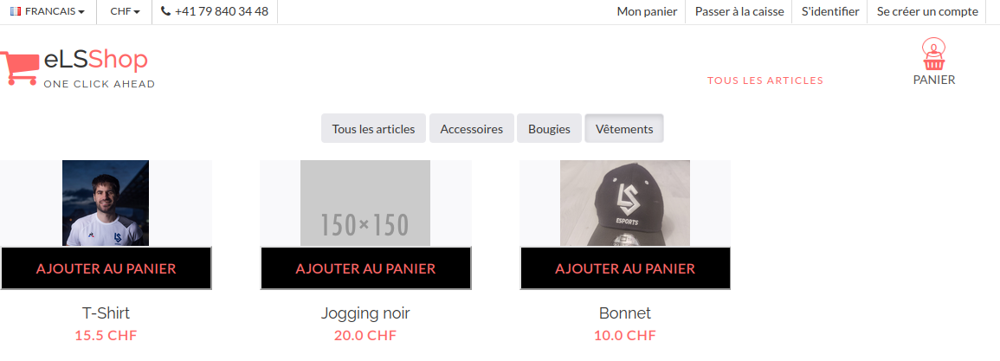
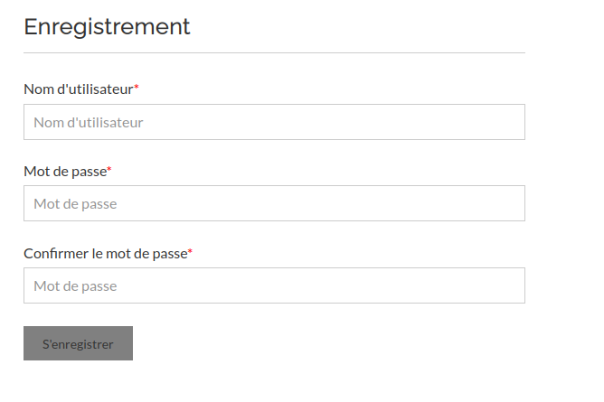
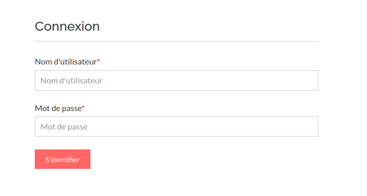
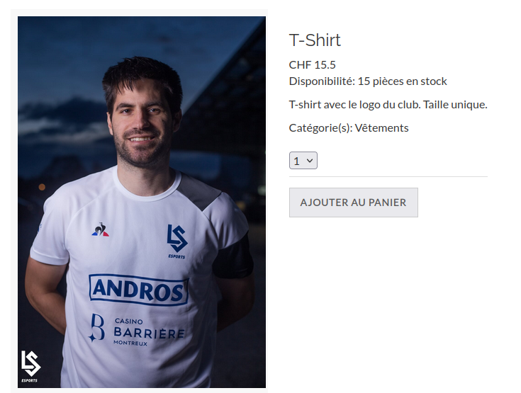
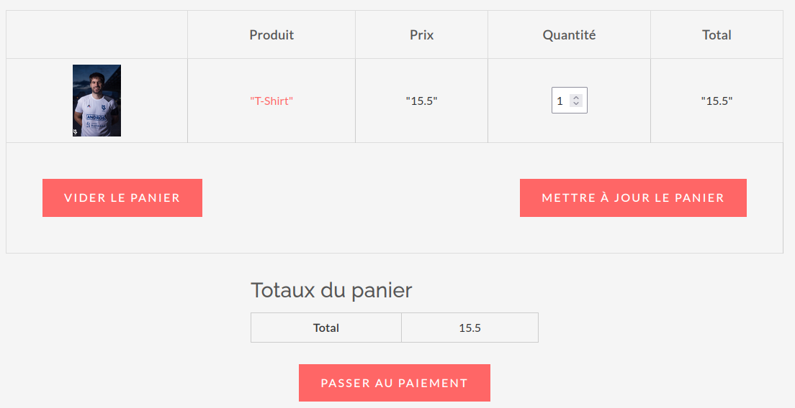

# AMT projet - ELS shop

> Auteurs : Jean-Luc Blanc, Gwendoline Dössegger, Rui Filipe Lopes Gouveia, Noémie Plancherel, Cassandre Wojciechowski
>
> Semestre d'automne 2021-2022


## Description

Cette application web est implémentée en Java à l'aide du framework Jakarta EE. Elle est dédiée à la vente de merchandising de Lausanne ESport.


## Prise en main

### Mise en place de la base de données

Le script mettant en place la base de données peut se trouver en suivant le lien : https://github.com/dosseggegw1/AMT_projet/blob/main/database/AMT_SQL.sql. Il faut exécuter ce script avant de créer l'utilisateur `shopels`. 

Le script suivant permet de créer un utiisateur `shopels` avec un mot de passe correspondant (à modifier pour plus de sécurité) :

```mysql
CREATE USER 'shopels'@'%' IDENTIFIED BY 'shopels2022';
GRANT USAGE ON AMT_SQL.* TO 'shopels'@'%';
GRANT SELECT, INSERT, UPDATE, DELETE, CREATE, DROP, INDEX, ALTER, SHOW VIEW, EXECUTE ON AMT_SQL.* TO 'shopels'@'%'; 
FLUSH PRIVILEGES;
```

> Ce script est à lancer depuis un compte ayant l'autorisation de créer des utilisateurs et de leur assigner des droits. 
>
> Les droits sont adaptés pour autoriser et interdire certaines actions à l'utilisateur sur la base de données `AMT_SQL`. 

Dans le code de l'application, il faut modifier les fichiers `hibernate.cfg.xml` et `persistence.xml` dans le répertoire `resources` pour indiquer les identifiants de connexion créés avec le script ci-dessus. Cela permettra à l'application de se connecter correctement à la base de données.


### Déploiement local

> Il est possible d'utiliser le serveur applicatif `Wildfly` directement avec IntelliJ, nous avons indiqué une marche à suivre dans notre Wiki : https://github.com/dosseggegw1/AMT_projet/wiki/Ajouter-JBoss-Widlfy-%C3%A0-Intellij. 

Dans un premier temps, il faut générer le fichier `/target/shop.war` à l'aide de la commande :
```sh
$ mvn clean install
```
Puis dans l'interface graphique de `WildFly`, aller dans `Administration Console > Deployements > Start`, puis effectuer un `drag & drop` du fichier `shop.war` dans la colonne grisée de gauche. Le chargement s'effectue automatiquement, et il est désormais possible de se rendre sur l'URL `http://localhost:8080/shop/` pour utiliser l'application. 


### Déploiement distant

> Nous avons créé une configuration spécifique pour nous connecter en `ssh` au serveur AWS. Une marche à suivre se trouve à https://github.com/dosseggegw1/AMT_projet/wiki/Acc%C3%A8s-SSH, à la rubrique "Alernative". 

L'installation distante (sur le serveur AWS) se fait relativement de la même manière.  La commande `ssh` utilisée pour se connecter au serveur est la suivante :

```bash
$ ssh -L 8080:localhost:8080 AMT-SHOPELS
```

> /!\ Les permissions sur le fichier `.pem` doivent être adaptées /!\ 

Puis, il faut charger le fichier `shop.war` sur le serveur distant depuis la machine locale et déplacer le fichier dans le répertoire approprié sur le serveur distant :

```bash
# Sur la machine locale
$ scp shop.war AMT-SHOPELS:

# Sur la machine distante
$ sudo mv shop.war /opt/wildfly/standalone/deployments
```

Après cette dernière manipulation, l'application est atteignable via l'URL `http://localhost:8080/shop/`.


## Usage



Sur la capture d'écran ci-dessus, nous trouvons dans l'en-tête plusieurs onglets. 

Pour un nouvel utilisateur, la première étape est de créer un compte, ce qui peut être fait en cliquant sur le lien tout en haut à droite de la page `Se créer un compte`. 

Pour un utilisateur déjà connu, il faut se connecter en cliquant sur le lien juste à gauche du lien mentionné précédemment `S'identifier`. 

Il existe deux possibilités pour atteindre son panier : soit le lien `Mon panier` tout en haut de la page, soit l'icône en dessous du lien `Se créer un compte`. 

On peut consulter différentes catégories de produits directement sur l'écran d'accueil de l'application, ainsi que tous les produits, pas triés par catégorie. En cliquant sur le nom de l'article, une nouvelle page est chargée pour afficher les détails concernant cet article. On peut ajouter un article à notre panier depuis la page `index` de base (ajout d'une quantité de 1) ou alors, depuis la page de détails sur l'article (ajout d'une quantité de 1 ou plus). 

| Activité             | Capture d'écran                  | Notes                                                        |
| -------------------- | -------------------------------- | ------------------------------------------------------------ |
| Création de compte   |  | L'utilisateur doit entre un nom, un mot de passe et il doit taper une seconde fois le mot de passe. S'il est correct, le bouton `S'enregistrer` devient cliquable |
| Identification       |   | L'utilisateur doit entrer un nom et un mot de passe corrects et correspondants entre eux. |
| Détails d'un article |   | Des détails sont disponibles sur l'article (nom, photo, prix, quantité, descriptif, catégorie) et il est possible de choisir une quantité à ajouter au panier. |
| Panier               |           | Il est possible de modifier la quantité des articles dans le panier directement depuis le panier, on peut le mettre à jour ou le vider complétement. |


## Support

En cas de souci avec l'application, les membres du groupe SHOPELS sont disponibles via Teams ou Telegram. 


## License

```
MIT License

Copyright (c) 2022 Blanc-Dössegger-LopesGouveia-Plancherel-Wojciechowski

Permission is hereby granted, free of charge, to any person obtaining a copy of this software and associated documentation files (the "Software"), to deal in the Software without restriction, including without limitation the rights to use, copy, modify, merge, publish, distribute, sublicense, and/or sell copies of the Software, and to permit persons to whom the Software is furnished to do so, subject to the following conditions:

The above copyright notice and this permission notice shall be included in all copies or substantial portions of the Software.

THE SOFTWARE IS PROVIDED "AS IS", WITHOUT WARRANTY OF ANY KIND, EXPRESS OR IMPLIED, INCLUDING BUT NOT LIMITED TO THE WARRANTIES OF MERCHANTABILITY, FITNESS FOR A PARTICULAR PURPOSE AND NONINFRINGEMENT. IN NO EVENT SHALL THE AUTHORS OR COPYRIGHT HOLDERS BE LIABLE FOR ANY CLAIM, DAMAGES OR OTHER LIABILITY, WHETHER IN AN ACTION OF CONTRACT, TORT OR OTHERWISE, ARISING FROM, OUT OF OR IN CONNECTION WITH THE SOFTWARE OR THE USE OR OTHER DEALINGS IN THE SOFTWARE.
```

