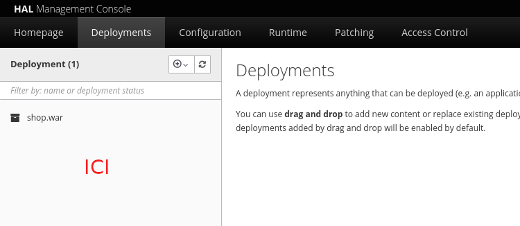

# AMT projet - eLS shop

> Jean-Luc Blanc, Gwendoline Dössegger, Rui Filipe Lopes Gouveia, Noémie Plancherel, Cassandre Wojciechowski

## Description
Cette application web est réalisé en java à l'aide du framework Jakarta EE. Elle est dédiée à la vente de merchandising de Lausanne ESport.

## Installation

Assurez-vous d'avoir au préalable installer les outils:

- Wildfly
- MySQL

En cas échéant, vous pouvez consulter le wiki pour plus d'informations https://github.com/dosseggegw1/AMT_projet/wiki.

### Version manuelle

Il faut tout d'abord télécharger la dernière release, disponible sur Github via https://github.com/dosseggegw1/AMT_projet/releases. 

Une fois cette étape effectuée, vous pouvez récupérer le fichier de base de données dans `database/AMT_SQL.sql` et le copier dans MySQL.

Puis il faut générer le fichier `/target/shop.war` à l'aide de la commande à la racine du projet:
```sh
mvn clean install
```
Dans l'interface graphique de `WildFly`, aller dans `deployement`. Vous pouvez drag-and-drop directement le fichier `shop.war` dans la colonne de gauche.



A présent, vous pouvez vous rendre sur `localhost:8080/shop`.

## Usage

## Support

## License
